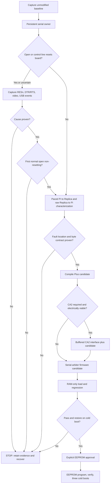

# Replica 1 Plus Propeller Serial Repair - Plan

## Goal Capsule

- **Objective:** Make the Replica 1 Plus a trustworthy bidirectional serial terminal while preserving its video, PS/2 keyboard, and recoverability.
- **Means:** Establish evidence before changing hardware, then repair the Plus firmware through a reversible RAM-load stage before any EEPROM commit. (KTD1, KTD6)
- **Authority:** Direct measurements and primary manufacturer or component documentation override historical handovers and old Replica 1 TE material.
- **Execution profile:** Characterization-first. One physical action or measurement per gate. Record the result before advancing.
- **Stop conditions:** Stop and recover when identity, voltage level, reset cause, byte sequence, or video behavior is uncertain or non-repeatable.
- **Tail ownership:** The implementer owns capture retention, recovery rehearsal, regression evidence, and the public troubleshooting record.

---

## Product Contract

### Summary

This plan creates a repeatable diagnostic and firmware workflow for the Replica 1 Plus serial fault. It establishes whether the fault is host control-line reset, serial pacing, FT232/board routing, shared keyboard-bus arbitration, or missing 6821 acknowledgement before a persistent firmware change is made.

### Problem Frame

The current serial tests open and close the programming-capable FT232R device repeatedly. Those tests cannot distinguish a reset or board-level fault from firmware behavior. The repository has no firmware source, harness, tests, capture format, recovery image, or documentation structure to make the repair reproducible.

### Requirements

**Evidence and safety**

- R1. The project must preserve a versioned, hash-verified candidate firmware baseline and a timestamped evidence packet before any firmware or hardware change; an EEPROM proposal additionally requires a revision-compatible recovery image proved by rehearsal.
- R2. The diagnostic process must use a single exclusive serial owner and must never treat shell redirection or an interactive terminal as a valid traffic generator, except for a recorded, exclusive programming lease to the identified uploader.
- R3. Each hardware or programming transition must produce an explicit PASS or STOP decision with a recovery path.

**Bidirectional serial behavior**

- R4. Pi-to-Replica tests must prove monitor-level acceptance of a known-safe 7-bit uppercase payload and CR at controlled pacing rates.
- R5. Replica-to-Pi tests must capture raw host bytes and independently locate a missing or malformed signal at the Propeller serial output or FT232 transmit path.
- R6. The byte encoding contract must be measured against the deployed board and source candidate. The bridge must not inherit a high-bit rule without that evidence.

**Firmware and hardware repair**

- R7. Firmware must serialize all writers to the 6821 keyboard bus and retain original video and PS/2 behavior.
- R8. A CA2 acknowledgement path may be added only after its timing, voltage, board route, and unused Propeller input are proven. It must use a reversible one-way level-shifted interface.
- R9. A firmware candidate must pass a volatile RAM-load acceptance suite and a cold-boot reversion check before an EEPROM commit is proposed.
- R10. EEPROM programming requires explicit user approval, prepared recovery artifacts, post-write verification, and repeated cold-boot regression evidence.

**Reproducibility**

- R11. The repository must record configuration, raw captures, pass/stop evidence, and troubleshooting outcomes so another builder can reproduce both the repair and rejected hypotheses.

### Key Decisions

- **Firmware repair is evidence-gated.** Pacing, reset, board routing, and firmware are separate causes that must not be collapsed into one diagnosis. Governs R1-R10.

### Actors

- A1. **Operator:** Connects hardware, approves an EEPROM commit, and performs physical recovery actions.
- A2. **Persistent serial owner:** The only host process allowed to open the FT232R serial device during ordinary diagnostics and bridge operation.
- A3. **Propeller/FT232/6821 subsystem:** Receives 7-bit serial input, drives the keyboard bus, mirrors display output, and can be reset or programmed through the USB serial path.

### Key Flows

- F1. **Baseline and characterization:** The operator records the unmodified machine, then the persistent owner captures reset, pacing, and raw-byte evidence. Covers R1-R6, R11.
- F2. **Firmware candidate:** The candidate is compiled and loaded into RAM only, then tested and cleared by reset or cold boot before persistence is considered. Covers R7-R9.
- F3. **Persistent repair:** After explicit approval, the candidate is programmed to EEPROM, verified, and tested across repeated cold boots. Covers R10-R11.

### Acceptance Examples

- AE1. **Covers R2, R4.** Given the target is identified through a stable USB-by-id path, when the persistent owner opens and settles the port, it sends a paced uppercase monitor command, then the display accepts the command without reset, garbage, or lost bytes.
- AE2. **Covers R5.** Given the host capture owner is active, when the PS/2 keyboard and `$FFEF` display path each emit a known sequence, the capture distinguishes host, Propeller P30, and FT232 TX results with synchronized timestamps.
- AE3. **Covers R8.** Given CA2 is not electrically safe or is not available in the required 6821 mode, when its evidence gate fails, U6 stops without adding a direct wire; the non-CA2 serial-arbiter path may continue to RAM-only validation, while EEPROM remains governed by R10.
- AE4. **Covers R9, R10.** Given a RAM-loaded candidate passes the suite, when the board resets before EEPROM programming, it returns to the EEPROM baseline; after an approved commit, three cold boots pass the same suite.

### Success Criteria

- The resulting evidence identifies the causal layer for each direction rather than asserting a firmware root cause from symptoms.
- The repaired system preserves video and PS/2 input while exchanging verified serial bytes in both directions.
- A failed candidate has a rehearsed recovery route that restores the documented, baseline-compatible behavior before further investigation.

### Scope Boundaries

- The LLM bridge, enclosure, monitor choice, keyboard selection, and CFFA1 work are outside this repair.
- The 100 kOhm isolated-ground screen-noise pull-up is excluded. It is not a remedy for the observed host-powered serial fault.
- Sowerbutts's Replica 1 TE binaries and its P9/P15 RTS/CTS wiring are excluded. The TE uses different hardware and the Plus candidate source assigns those pins to CLEAR and the 1 MHz clock.

#### Deferred to Follow-Up Work

- Hardware RTS/CTS is deferred until the CA2 path and ordinary 9600-baud repair pass, and only after the actual FT232R handshake pins and polarity are traced.
- The production LLM bridge is deferred until the serial byte contract and persistent-owner interface are proven.

### Sources / Research

- ReActiveMicro's Replica 1 documentation identifies the Plus source archive, EEPROM load procedure, and the separate isolated-ground screen-noise pull-up: https://wiki.reactivemicro.com/Replica_1
- The Briel Replica 1 Plus manual defines 9600 8N1, no flow control, 50 ms per character, and 200 ms per line. Import the source manual under `docs/reference/` with provenance before using it as a local implementation reference.
- The manufacturer-hosted `110REV03` archive is the candidate source baseline. Its observed behavior must not be presented as proof of the deployed EEPROM image.
- Parallax P8X32A programming protocol distinguishes RAM-only LoadRun from EEPROM ProgramRun and defines reset timing: https://forums.parallax.com/discussion/download/131200/PropellerProgrammingProtocol.pdf
- Parallax P8X32A documentation defines boot, EEPROM, and general I/O behavior: https://www.parallax.com/download/propeller-1-documentation/
- FT232R control and handshake signals: https://ftdichip.com/wp-content/uploads/2020/08/DS_FT232R.pdf
- MC6821 CA1/CA2 handshake modes: https://www.komponenten.es.aau.dk/fileadmin/komponenten/Data_Sheet/Microprossor/MC6821.pdf

---

## Planning Contract

### Key Technical Decisions

- KTD1. **Use an evidence-gated repair state machine.** Every transition has an evidence packet and a PASS or STOP decision. Recover to the known baseline after unexpected reset, video loss, unsafe voltage, or byte mismatch.
- KTD2. **Make one process the persistent serial owner.** It locks the stable USB-by-id target, applies an explicit DTR/RTS policy before open when possible, settles, drains startup data, captures raw traffic, and quarantines reconnects. Programming is the sole exception: the owner records and releases an exclusive maintenance lease to one identified uploader, then re-identifies and quarantines the returned device. This replaces `cat`, `echo`, and per-character redirection.
- KTD3. **Treat reset-on-open as a board-wiring hypothesis.** FT232R control outputs exist, but their routing to Propeller RESn is not proven. The plan requires synchronized host, control-line, USB, video, and raw-byte evidence before causal conclusions. If no repeatably non-resetting first normal open can be demonstrated after the cause is measured, stop firmware work and return the board path to hardware remediation.
- KTD4. **Use the Plus candidate source as a characterization target, not deployed truth.** It indicates P30/P31 serial pins, a 7 ms serial strobe, a 16-byte receive ring, `serdata < 96`, P9 CLEAR, and P15 clock. Each property must be checked against the board before a design depends on it.
- KTD5. **Serialize keyboard-bus producers.** PS/2 and serial input must feed one arbitration path before that path controls the shared data bus, strobe, buffer control, and acknowledgement wait. CA2 alone does not remove concurrent-writer races.
- KTD6. **Forbid a direct CA2-to-Propeller connection.** CA2 originates as 5 V 6821 logic and the Propeller input is 3.3 V. A CA2 option requires a high-impedance timing capture, traced net, one-way level shifter, validated spare GPIO, and reversible wiring. (session-settled: user-approved — chosen over the TE direct-wire concept: the Plus electrical and pin map differ.)
- KTD7. **Load candidate firmware into RAM before EEPROM.** A RAM-only run proves behavior without persistence. Reset and cold boot must restore the EEPROM baseline before an EEPROM commit is offered. A candidate source archive is not a recovery image: persistence additionally requires a revision-compatible recovery artifact, its provenance and hash, and a rehearsed RAM load/restore procedure.
- KTD8. **Reject the resistor-first and TE-binary paths.** The documented resistor is for isolated-ground screen noise. TE images and pin mappings are not Plus firmware. (session-settled: user-approved — chosen over speculative soldering or a drop-in TE flash: neither diagnoses the Plus fault safely.)

### High-Level Technical Design



### Output Structure

```text
docs/
  firmware-baseline.md
  serial-test-protocol.md
  firmware-recovery.md
  troubleshooting.md
  hardware/
    plus-io-map.md
  reference/
    README.md
  captures/
    README.md
firmware/
  vendor/110REV03/
  plus/
tools/
  serial_owner.py
  capture_manifest.py
tests/
  test_serial_owner.py
  test_capture_manifest.py
  test_firmware_source_audit.py
requirements-dev.txt
```

### Dependencies / Prerequisites

- A direct, stable USB host connection and a known board power/recovery procedure.
- A logic analyzer or scope with a high-impedance probe, common ground discipline, and channels for the relevant signal captures.
- The manufacturer source archive, source checksum, locally compiled candidate checksum, and a known-good uploader must be retained before RAM loading.
- The owner must establish and retain the actual `/dev/serial/by-id/` identity. It must not rely on `/dev/ttyUSB0` numbering.

### Risks & Mitigations

| Risk | Mitigation |
|---|---|
| Port open changes control lines or resets the board | Capture and document the board-specific effect before using pacing results. |
| Another process owns or modifies the port | Require an exclusive lock and identify getty, ModemManager, brltty, IDEs, and terminals before each run. |
| CA2 damages the Propeller | Use no direct connection. Gate any CA2 modification on voltage, timing, route, buffer, and rollback evidence. |
| Candidate firmware removes video or keyboard | Test RAM only first. Reset or cold boot must recover the EEPROM baseline. |
| EEPROM failure leaves no known-good state | Do not propose persistence until a revision-compatible recovery image has provenance, a hash, and a rehearsed RAM restore; retain two copies and require explicit approval. |
| Evidence cannot be reproduced | Version raw captures, topology, port metadata, tool version, source hash, and observed result together. |

---

## Implementation Units

### U1. Bootstrap source provenance and evidence records

- **Goal:** Create the versioned project structure that distinguishes vendor artifacts, measured facts, and hypotheses.
- **Requirements:** R1, R3, R11.
- **Dependencies:** None.
- **Files:** `README.md`, `docs/firmware-baseline.md`, `docs/hardware/plus-io-map.md`, `docs/reference/README.md`, `docs/captures/README.md`, `firmware/vendor/110REV03/`, `tests/test_firmware_source_audit.py`.
- **Approach:** Import the manufacturer source archive without modification. Record URL, retrieval date, checksum, compiler version, candidate pin map, and the fact that it is not a readback of the installed EEPROM. Add a board topology sheet with photos, FT232R switch position, USB path, power source, signal names, voltage domains, and rollback points. If persistence could be proposed, obtain a revision-compatible recovery image separately, record compatibility evidence and its toolchain, and prove its RAM load/restore path; source provenance alone cannot pass that gate.
- **Execution note:** Start with characterization and provenance coverage before creating firmware changes.
- **Test scenarios:**
  - A source audit rejects a missing vendor provenance record or SHA-256 value.
  - A source audit confirms the expected candidate source files and pin-map claims are documented as candidate facts.
  - A capture manifest rejects a record without target identity, timestamp, topology, or result classification.
  - A persistence preflight rejects a candidate recovery artifact without revision-compatibility evidence or a rehearsed RAM restore record.
- **Verification:** A fresh clone can identify the source candidate, board connection, evidence format, and recovery dependencies without reading a handover.

### U2. Build the persistent serial owner and capture format

- **Goal:** Replace ad hoc serial shell commands with one exclusive, reset-aware host process.
- **Requirements:** R2, R3, R6, R11.
- **Dependencies:** U1.
- **Files:** `tools/serial_owner.py`, `tools/capture_manifest.py`, `requirements-dev.txt`, `tests/test_serial_owner.py`, `tests/test_capture_manifest.py`, `docs/serial-test-protocol.md`.
- **Approach:** Define a host-side lifecycle of identify, lock, configure, open, settle, drain, capture, transmit, quarantine, and close. Define a maintenance/programming lease: drain and retain state, release the lock only to the identified uploader, record its completion/reset window, then re-identify and quarantine before ordinary owner traffic resumes. Make DTR and RTS requested state, observed state, settle interval, and owner identity capture fields. Provide a test-only fake transport so state logic is verified without the production board.
- **Execution note:** Implement behavior test-first. Hardware runs begin only after fake-transport and manifest tests pass.
- **Test scenarios:**
  - A second owner cannot acquire the same stable device identity.
  - Opening configures 9600 8N1 with software and hardware flow control disabled, then waits before traffic.
  - A reconnect enters quarantine and transmits nothing until re-identification succeeds.
  - A programming lease prevents normal owner traffic, rejects a second uploader, and requires re-identification after the uploader releases the device.
  - A capture stores raw receive bytes, transmitted bytes, timestamps, requested control-line state, and observed metadata.
  - A payload encoder rejects unmeasured high-bit transformation and records the chosen byte contract.
- **Verification:** The only normal host interface to the serial device is the owner process, and its capture can reconstruct a test without a terminal transcript.

### U3. Characterize reset, input pacing, and output path

- **Goal:** Produce reproducible evidence locating the fault in each direction before source changes.
- **Requirements:** R3-R6, R11.
- **Dependencies:** U1, U2.
- **Files:** `docs/serial-test-protocol.md`, `docs/captures/README.md`, `docs/troubleshooting.md`, `tests/test_capture_manifest.py`.
- **Approach:** Define individual test cards for unopened idle, cable connection, persistent open, controlled DTR/RTS changes, paced Pi-to-Replica input, PS/2 echo, and `$FFEF` output. Require a known monitor prompt and reset-to-known-state between pacing runs. Correlate host capture with Propeller P30 and FT232 TX captures when the output path is absent or malformed.
- **Execution note:** Treat each card as a STOP gate when video changes, bytes drift, or the result cannot be repeated.
- **Test scenarios:**
  - A reset-on-open packet contains synchronized host, USB, control-line, video or LED, and raw-byte observations.
  - A paced input packet records semantic monitor acceptance of `TEST` plus CR at 500 ms, 50 ms, and 10 ms character intervals.
  - A raw-output packet separates expected PS/2 and `$FFEF` sequences from framing or repeated-byte failure.
  - A missing host byte sequence requires P30 and FT232 TX observations before a firmware conclusion is recorded.
- **Verification:** The troubleshooting record uses `Symptom -> Hypothesis -> Test -> Result -> Conclusion` and identifies whether each direction is reset, timing, firmware, or board-path limited. A measured reset-on-open result may advance only when a non-resetting normal open is repeatable; otherwise it stops at board-path remediation.

### U4. Establish a compilable Plus firmware baseline and source-level tests

- **Goal:** Make the Plus candidate source buildable and make its pin and byte assumptions executable checks.
- **Requirements:** R1, R6, R7, R9.
- **Dependencies:** U1, U3.
- **Files:** `firmware/plus/`, `firmware/vendor/110REV03/`, `tests/test_firmware_source_audit.py`, `docs/firmware-baseline.md`.
- **Approach:** Keep vendor files immutable. Place all changes in the Plus working tree. Document the selected Spin toolchain and compile-only output hash. Test source-level claims such as pin ownership, serial filter behavior, strobe timing, and absence of unsupported TE assignments.
- **Test scenarios:**
  - The baseline compile produces a recorded image hash without programming hardware.
  - The pin audit fails if a candidate assigns P9 or P15 to TE flow-control roles.
  - The byte-contract audit fails if the code silently enables a high-bit transmit transformation.
  - A baseline-characterization audit records the vendor candidate's independent PS/2 and serial writers as an expected pre-repair condition, not a passing compliance condition.
  - A candidate-compliance audit fails if PS/2 and serial writers can independently own the keyboard-bus outputs after U5.
- **Verification:** The working source tree has a documented diff from vendor files and can be compiled without an EEPROM write.

### U5. Implement single-owner keyboard-bus firmware arbitration

- **Goal:** Remove unsynchronized PS/2 and serial writes to the shared keyboard data and strobe path.
- **Requirements:** R4-R7.
- **Dependencies:** U3, U4.
- **Files:** `firmware/plus/replica 110REV03.spin`, `firmware/plus/Serial_IO.spin`, `firmware/plus/Keyboard.spin`, `tests/test_firmware_source_audit.py`, `docs/firmware-baseline.md`.
- **Approach:** Begin only if U3 establishes a shared-writer fault, or if the operator explicitly approves a preventive refactor after U3 has excluded a board-only cause. Refactor the Plus candidate so PS/2 and serial producers enqueue input while one bus-service path alone controls data, strobe, direction, buffer state, and completion handling. Set queue capacity and the owner pacing ceiling from the measured service/acknowledgement time; when full, stop transmission, retain the capture, and require re-characterization rather than silently dropping or reordering bytes. Preserve 7-bit compatibility unless U3 measures a different deployed contract.
- **Execution note:** Add characterization checks before changing bus timing. The first hardware load remains RAM only under U7.
- **Test scenarios:**
  - Concurrent producer simulation preserves order and prevents overlapping strobe ownership.
  - A 7-bit uppercase serial byte and CR reach the bus-service path without high-bit alteration.
  - Unsupported input bytes have an explicit measured handling policy rather than incidental discard.
  - Sustained input at the declared owner pacing ceiling preserves byte order; a full queue produces a recorded stop, never an unreported drop.
  - PS/2 input, serial input, video output, and `$FFEF` mirroring retain their expected routes in the source audit.
- **Verification:** Source audits demonstrate one keyboard-bus writer and the compiled candidate preserves the declared pin map.

### U6. Add a buffered CA2 acknowledgement path only if its evidence gate passes

- **Goal:** Replace fixed serial-input timing with read acknowledgement when the Plus board can support it safely.
- **Requirements:** R7-R9.
- **Dependencies:** U3, U4, U5.
- **Files:** `firmware/plus/replica 110REV03.spin`, `docs/hardware/plus-io-map.md`, `docs/serial-test-protocol.md`, `docs/firmware-recovery.md`, `tests/test_firmware_source_audit.py`.
- **Approach:** First record CA1, CA2, data bus, and relevant 6502 activity. If CA2 follows the required 6821 mode, select a verified unused Propeller input and add a one-way level-shifted, reversible interface. Update the bus service to wait for the observed acknowledgement with a watchdog and defined STOP outcome.
- **Execution note:** This unit is conditional. Do not begin it if the electrical or timing evidence is incomplete.
- **Test scenarios:**
  - The hardware map rejects direct 5 V CA2-to-3.3 V Propeller wiring.
  - The source audit rejects a CA2 input on a pin claimed by video, clock, CLEAR, PS/2, or serial transport.
  - A capture shows each injected byte has one CA1 event and the expected CA2 acknowledgement before the next byte.
  - A missing acknowledgement triggers the defined recovery stop rather than a permanent firmware hang.
- **Verification:** The modified board and RAM-loaded candidate retain video, PS/2, and both serial directions while the captured acknowledgement timing matches the documented contract.

### U7. Validate RAM-only firmware and govern EEPROM persistence

- **Goal:** Prove and, only with approval, persist a repaired firmware image without losing recovery capability.
- **Requirements:** R1, R3, R9-R11.
- **Dependencies:** U3-U6, depending on whether U6 passes its gate.
- **Files:** `docs/firmware-recovery.md`, `docs/serial-test-protocol.md`, `docs/troubleshooting.md`, `docs/captures/README.md`.
- **Approach:** Define a RAM-load acceptance suite before persistence. Pre-stage a revision-compatible recovery image whose RAM load/restore has been rehearsed, a separately retained copy, uploader identity, stable direct power, and physical reset instructions. Transfer the serial owner through the recorded programming lease, then re-identify and quarantine it after every programmer run. Make EEPROM programming an operator-approved transition only. On failure, perform one prepared restore, record the result, and stop for hardware diagnosis.
- **Execution note:** Prefer a RAM-only smoke and regression suite over iterative EEPROM experiments.
- **Test scenarios:**
  - A RAM-loaded candidate passes video, PS/2, paced input, PS/2 echo, `$FFEF` output, and repeated reset tests.
  - A cold boot after RAM load restores the EEPROM baseline without manual firmware repair.
  - An EEPROM commit is blocked without explicit approval, two retained recovery-image copies with hashes, revision-compatibility evidence, and a successful recovery rehearsal.
  - After a commit, three cold boots each pass the complete regression suite.
  - An unsuccessful EEPROM write invokes the documented restore once and records the resulting hardware state.
- **Verification:** EEPROM persistence is proposed only after the RAM candidate, reversion check, recovery rehearsal, and complete evidence packet pass.

---

## Verification Contract

| Area | Proof | Applicability |
|---|---|---|
| Host tooling | `python -m pytest tests` passes against fake transport and capture fixtures | U1-U2, U4-U6 |
| Source integrity | `python -m pytest tests/test_firmware_source_audit.py` records the vendor baseline separately and verifies candidate provenance, pin ownership, byte contract, and one bus writer | U1, U4-U6 |
| Baseline safety | Unmodified video, PS/2, monitor prompt, and board power topology are captured before each physical branch | U1, U3, U6-U7 |
| Input behavior | Known prompt accepts the measured 7-bit payload and CR at each planned pacing rate | U3, U5-U7 |
| Output behavior | Raw host capture, P30, and FT232 TX captures identify the same expected output sequence | U3, U5-U7 |
| Volatile firmware | RAM-only candidate passes regression and cold boot returns to the EEPROM baseline | U7 |
| Persistent firmware | Approved EEPROM candidate passes verification and three cold-boot regressions | U7 |

---

## Definition of Done

- Every active requirement is traced to at least one implementation unit and verification outcome.
- The repository contains an immutable, hash-verified candidate baseline and does not mislabel it as EEPROM readback; no EEPROM commit proceeds without a rehearsed, revision-compatible recovery image.
- No ordinary workflow opens the target serial port outside the persistent owner.
- The evidence record identifies the actual byte contract and causal layer for both directions.
- Firmware has one keyboard-bus owner and preserves video and PS/2 behavior.
- Any CA2 interface is level shifted, reversible, and justified by a captured 6821 timing trace.
- EEPROM programming occurred only after explicit approval, a passing RAM suite, a cold-boot reversion check, recovery rehearsal, and three passing cold boots after persistence.
- Rejected hypotheses, failed candidate behavior, and recovery results are retained in the troubleshooting format.
- Experimental files and temporary wiring from abandoned paths are removed or explicitly retained as reversible evidence.

---

## Documentation / Operational Notes

- Use Windows-native PowerShell in operator documentation. Mark Pi-side commands as Linux commands.
- Capture non-repeatable facts as they occur, including board photos, scope screenshots, raw byte files, source hashes, control-line policy, and USB identity.
- A bridge implementation must integrate through the persistent owner. It must not open the serial device for each request or byte.
- Do not add or recommend the 100 kOhm pull-up unless a separate isolated-ground screen-noise diagnosis satisfies its own evidence protocol.
